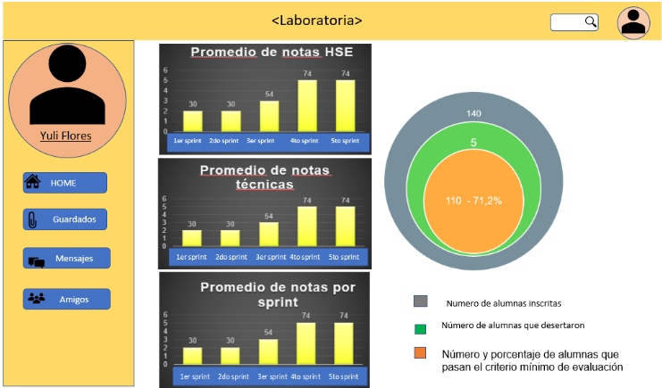

# Reto sktech
***
## Objetivo:

 Crea un sketch para la herramienta del dashboard de Laboratoria
 
1-.Número de alumnas inscritas

2-. Número de alumnas que desertaron

3-. Número y porcentaje de alumnas que pasan el criterio mínimo de evaluación

4-.Promedio de notas por sprint

5-.Promedio de notas HSE

6-.Promedio de notas técnicas

